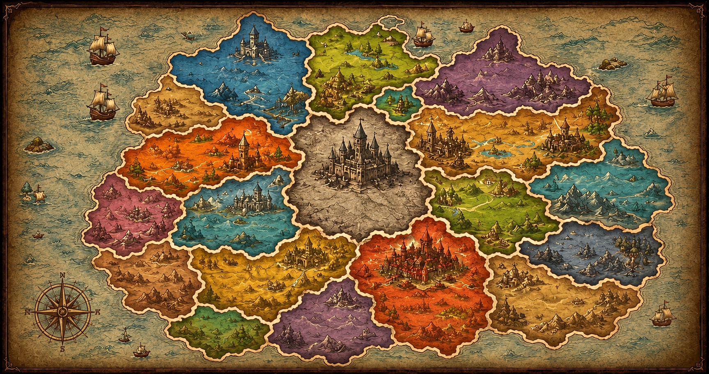

# Grammaria

An illustrated fantasy strategy game for learning English grammar. Players explore a living world map, meet realm guides, study grammar rules, and conquer territories through interactive challenges.



## Highlights

- Interactive fantasy map with 18 grammar territories
- Dedicated illustrated realm experiences for Artikel and Temporalia
- Animated guide characters and dialogue-driven introductions
- Grammar study guides, examples, rewards, and battle questions
- Commander profile hall with campaign progress and mastery insights
- Daily quests, rewards, events, and leaderboard flows
- Responsive UI with reduced-motion accessibility support

## Technology

- Next.js 16 with the App Router
- React 19 and TypeScript
- Tailwind CSS 4
- Framer Motion
- Lucide icons
- Canvas Confetti

## Run locally

```bash
npm install
npm run dev
```

Open [http://localhost:3000](http://localhost:3000).

## Quality checks

```bash
npm run lint
npx tsc --noEmit
npm run build
```

The production build downloads Google Fonts through `next/font`, so network access is required during the build.

## Project structure

```text
src/
  app/                 App Router entry point and global theme
  components/          Map, HUD, actions, and game interfaces
  components/modals/   Territory, battle, profile, and reward experiences
  data/                Player, territory, and leaderboard content
  types/               Shared game types
public/                 Map, realm, and character artwork
```

## Gameplay loop

1. Select a territory on the map.
2. Meet its guide and inspect the study material.
3. Begin training or launch an attack.
4. Answer grammar challenges to reduce resistance.
5. Earn XP and coins, capture realms, and advance toward Centralia.

## Current status

Grammaria is an actively developed prototype. Major UI and gameplay milestones are committed separately so the project history remains easy to follow.
